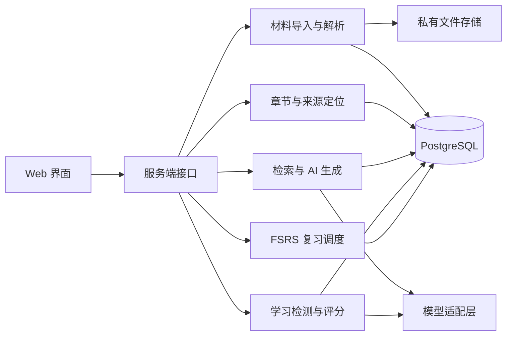

# Reador 技术方案

本文是应用后端的建议方案，尚未搭建服务端或数据库。现有 HTML 原型已包含固定版本的 Mermaid 浏览器依赖；真实书籍解析、模型调用与持久化待实现。材料入口按 PDF / EPUB 推进，部署环境和模型提供商将在后端实现时固定。

## 建议技术选型

| 层次 | 建议 | 理由 |
| --- | --- | --- |
| 应用 | Next.js + TypeScript | 在同一仓库实现页面与服务端接口，便于首版交付 |
| 样式 | Tailwind CSS | 快速搭建阅读工作台与响应式布局 |
| 数据 | PostgreSQL + Drizzle ORM | 统一管理书籍、学习记录、事务与数据迁移 |
| 内容存储 | 开发期使用私有本地目录，部署时使用私有对象存储 | 原始文件与数据库记录分离，禁止直接暴露上传目录 |
| AI | 服务端模型适配层 + Zod 输出校验 | 隔离不同模型接口，验证题目、评分和引用格式 |
| 图谱 | 结构化 JSON + Mermaid | 原型固定 `12.1.0`，由确定性编译器生成图表；关系和引用独立保存 |
| 调度 | `ts-fsrs` | 使用真实 FSRS 实现，保存算法版本与参数 |
| 验证 | Vitest；完整流程使用浏览器测试 | 分别验证核心逻辑和用户操作闭环 |

首版采用模块化单体。概念图谱以版本化 JSON 与概念关系记录保存，编译为 Mermaid 展示，无需独立图数据库。以章节为批次处理，合并为全书总览；整书检索达到实际需要后再引入向量索引。详见 [书籍概念图 Agent](book-concept-agent.md)。

## 参考项目带来的设计选择

详见 [Learny / Tutor 参考研究](references.md)。参考两者的能力边界，沿用当前 TypeScript Web 单体建议：

- **结构化原文**：借鉴 Learny，先持久化章节和原文块，再派生检索片段、模型用 Markdown 与展示内容，重建索引不改变原文身份。
- **可调整的教学层**：借鉴 Tutor，将学习档案、章节反馈与作答证据用于辅助讲解和练习，不覆盖原书正文。
- **统一会话**：问答与引导教学共用会话、来源和历史结构，通过每轮模式区分行为。
- **外部依赖接口**：解析器、模型、存储、时钟与调度通过小型接口注入；核心学习策略可用确定性适配器验证。
- **学习数据分离**：题面和来源快照、FSRS 状态、复习历史独立持久化，内容变更不能重置进度。

首版不因参考仓库引入 Python 服务、Celery 或 Electron。若 PDF 解析质量和资源消耗实际需要独立进程，再按解析接口替换实现。

## 模块与数据流



建议的目录边界：

```text
src/
  app/                    页面与服务端入口
  components/             通用界面组件
  modules/
    books/                导入、解析、章节和原文位置
    reading/              阅读进度与章节内容
    knowledge/            总结、概念及关系
    chat/                 统一会话、检索、问答和引用
    teaching/             教学阶段、渐进提示与辅助讲解
    learning/             题目、作答、评分与补救
    review/               FSRS 适配、评级与到期队列
  lib/
    ai/                   模型调用与结构化输出
    db/                   数据库连接与表定义
    storage/              私有文件读写
tests/
  fixtures/               可公开的小型测试原文
```

该目录结构为规划，尚未创建空代码模块。

## 核心数据结构

所有用户资源均带拥有者标识。通过外键、查询条件和服务端授权共同保证关联对象属于同一拥有者与书籍；不能只依赖前端传入的 ID。

| 实体 | 关键字段或关系 |
| --- | --- |
| Book | 拥有者、标题、格式、原始文件位置、内容哈希、解析状态与错误 |
| Chapter / SourceBlock | 章节层级；原文块的稳定锚点、类型、顺序、内容、原始位置与版本 |
| SourceChunk | 所属章节、片段 ID、引用的原文块及范围、派生文本与内容版本 |
| ReadingProgress | 拥有者、书籍、章节、阅读位置与更新时间 |
| GeneratedArtifact | 总结或图谱产物、来源版本、模型、提示词版本、生成状态 |
| GraphJob / GraphVersion | 生成任务、批次检查点、幂等键及实际覆盖范围；图谱 JSON、Mermaid、来源版本、skill 与编译器版本 |
| Concept / ConceptRelation | 所属书籍、概念描述；关系起点、终点、类型与来源片段 |
| Conversation / ChatMessage | 拥有者、书籍、来源范围；每轮回答或教学模式、角色、正文、引用快照与生成状态 |
| LearnerProfile / ChapterFeedback | 可选的目标、基础与解释偏好及版本；章节难点、反馈和关联学习证据 |
| TeachingSession / TeachingTurn | 关联会话与知识目标、教学阶段、提示等级、用户选择、采用的证据与生成讲解版本 |
| Question | 对应知识点、题面、参考答案、评分要点、权重与来源 |
| StudySession / Attempt | 学习或复习模式、题目、原始作答、提交时间、是否看过提示、是否补救练习 |
| Assessment | 所属作答、各要点得分、解释、依据、AI 建议评级与用户修正 |
| ReviewCard | 稳定的知识目标、当前题面版本、来源快照与待核对状态 |
| CardSchedule | 所属卡片、FSRS 卡片状态、到期时间、算法及参数版本、并发更新版本 |
| ReviewLog | 卡片、学习轮次、最终评级、调度前后状态、调度时间、幂等键 |

一个章节可以包含多个概念；一个概念按可独立检测的学习目标拆成复习卡。重新生成题面不能无声改变复习卡的知识目标，也不能丢失既有历史。

## 材料解析与原文引用

1. 导入时验证真实文件类型、大小与解析限额，记录文件哈希和处理状态。
2. PDF 保留实际页序号与页内文本位置；印刷页码可能不同，界面需区分。EPUB 保留目录、spine 顺序及文件内位置。
3. 没有可靠目录时，使用明确标注的章节建议或页范围分段，允许用户调整；不把推断的目录当作原书目录。
4. 先保存带稳定锚点的原文块，再在章节内派生来源片段，同时保存片段到原文块的范围映射。片段 ID 随重建可以变化，原文锚点和版本用于重定位；超长段落切分后仍可回到原文。
5. AI 接收片段 ID 与正文，只能引用提供过的 ID；服务端再次验证引用范围与内容版本。
6. 摘要的章节覆盖范围要明确。长章节分段处理再汇总，并保留分段来源，不静默截断后宣称覆盖全章。

整书问答按用户和书籍范围检索，再将相关片段送入模型。来源验证只能检查引用是否合法，不能证明结论正确；还需用固定样例评估结论与原文是否一致。

检索范围是服务端约束。选段和当前章模式没有证据时返回明确状态，由用户扩大范围；不能自动退回整书。范围发生变化后，后续生成需重新筛选历史中携带的引用与内容，避免旧消息带入范围外答案。中文书籍的检索评估应使用中文样例；将来引入 PostgreSQL 全文与向量混合检索时，需验证中文分词，不能默认套用英文配置。

解析 EPUB 等归档文件时限制展开大小、条目数量并拒绝路径穿越。书籍中的 HTML、链接和嵌入内容只作为阅读材料，展示前清理可执行内容，不执行脚本或自动请求远程资源。

## 生成与评分

模型适配层提供总结、概念提取、问答、出题、评分和讲解能力。每次调用记录模型和提示词版本、来源版本、处理状态；默认不将全文、答案或密钥写入日志。

结构化响应除了格式校验，还应检查业务条件：分数范围、权重合计、必需评分要点、引用存在性与书籍归属。不合法的响应不能进入学习历史或调度流程。重试需有次数上限，失败时允许用户重新发起。

评分必须使用保存下来的题目、评分要点与原文，不接受客户端指定参考答案或最终分数。用户修改 AI 评分时保留修改前后的记录。

首版默认以少量简答题和主动回忆实现闭环。题目和评分通过同一模型生成可能具有共同偏差，因此验收样例应包含人工确定的正确、部分正确和错误答案。

## 反馈驱动的教学

教学服务输入当前知识目标、范围内证据、用户确认的档案偏好和相关作答记录，输出下一步教学动作及辅助内容。优先定位具体错误：遗漏关键点、混淆概念、推理错误或无法迁移，再决定补充定义、对比例子或新的练习。

教学阶段使用显式状态：诊断、提示、讲解、检查、结束。用户选择直接讲解时可以跳过提示，选择退出时保存当前状态。参考答案是否已展示、提示等级和原文是否已打开由应用记录，不能由模型自由推断。

教学回复写入独立产物及来源快照，保留生成时的档案版本和学习证据。补救题记录关联的初次作答，围绕相同知识目标改变情境。正式检测沿用保存的评分标准，不能为适应用户而自动放宽标准。

## FSRS 状态更新

- 由适配层封装库的卡片状态和四档评级；只使用库公开支持的接口，接入时确认版本文档。
- AI 的数值评分提供反馈，最终记忆评级由用户确认。首次失败后立即补救成功，仍保留首次失败的调度依据。
- 补救练习写入 Attempt 与 Assessment，默认不单独推动 FSRS；按库安排的下一次学习或复习则产生新的 ReviewLog。
- 用数据库事务原子写入 ReviewLog 和卡片新状态；幂等键设唯一约束，卡片状态使用版本校验或行锁，避免并发覆盖。
- 原文重解析后核对卡片的来源快照，能匹配则重定位，不能匹配则标记待核对并暂停该卡自动出题；该过程不写 CardSchedule 或删除 ReviewLog。
- 保存调度前后状态、最终评级、调度时间和参数版本，以便解释下一次到期时间并排查问题。
- 到期列表基于持久化的 `due_at` 查询。用户重新打开页面即可看到到期卡片，首版不依赖通知服务或定时任务。

## 运行边界与可靠性

- 本地个人原型可以使用固定的本地拥有者，但只能面向本机使用；对外提供服务前补齐身份认证和权限验证。
- 调用外部模型前，在导入或设置中说明会发送哪些书籍片段和答案；服务端只发送完成任务所需的内容。
- 解析和生成状态区分待处理、处理中、完成与失败。长任务需要持久化执行状态和恢复策略；达到请求时限风险时再增加任务执行器。
- 书籍内容更新会影响摘要、引用和题目，需标记相关产物过期；不得把旧来源版本直接解释为新内容。
- 删除书籍时处理原始文件、派生产物、问答和学习记录的关联，不保留无法解释的孤立记录。
- 上传大小、章节长度、生成题数与模型费用均需设置明确上限，在实现时根据运行环境确定。

## 参考机制的验收

除产品文档的完整流程外，核心验证需覆盖原文锚点重定位、范围外内容隔离、提示状态与独立作答区分、内容更新不改变 FSRS 历史。真实适配器和假适配器在可运行的依赖边界共享契约测试；需要付费或远程模型的部分单独验证，不用假响应测试宣称真实教学质量达标。

## 实现前待确认

- PDF / EPUB 解析器的实现先后及对测试书籍的提取质量；入口格式已纳入产品流程。
- 先做本地个人工具，还是需要登录的在线服务。
- 模型提供商、可用能力与费用预期。

上述事项不影响项目约定和学习闭环，但会影响依赖、认证、文件存储和部署配置。

## Agent 配置原型与后续接入

`assets/agent-settings.js` / `assets/agent-settings.css` 为 Dashboard 的独立设置模块，当前仅管理页面内存中的配置，不调用模型，也不保存 API Key。默认 Agent 只是界面选择，不影响原有示例生成。配置字段为：名称、厂商、官方或第三方接入方式、协议、接口前缀、模型 ID、超时秒数、有限重试次数、最大输出 tokens、可选 Temperature。模型 ID 自由输入，不假设模型权限或自动宣称兼容。

地址以完整 API 前缀为准：例如 OpenAI 使用 `https://api.openai.com/v1`，GLM 使用 `https://open.bigmodel.cn/api/paas/v4`。拼接时只追加 `/responses`、`/messages` 或 `/chat/completions`，不会强行添加 `/v1`。表单拒绝完整端点误填、URL 中的账号密码、查询参数与片段；本机回环地址允许 HTTP，其余使用 HTTPS。官方接入使用已核对预设，第三方接入允许自由选择三种协议。

后续服务端实现必须将配置与凭据分开：配置记录归属当前用户，凭据单独加密保存或引用服务端环境变量，浏览器只收到“已配置”状态。由独立适配层将统一输入转为对应协议的请求及响应，不通过更换 URL 假装完成协议兼容。Responses、Messages 和 Chat Completions 的消息结构、认证头、输出上限字段、流式事件和结构化输出能力需要分别实现与验证。Temperature 留空时省略；模型不支持的参数不能直接传入。设置与模型调用错误中不得回显凭据。

预设来源（2026-10-08 核对）：[OpenAI 官方快速入门](https://developers.openai.com/api/docs/quickstart)、[Claude API 总览](https://platform.claude.com/docs/en/api/overview)、[智谱 OpenAI 兼容接口](https://docs.bigmodel.cn/cn/guide/develop/openai/introduction)、[DeepSeek 首次调用](https://api-docs.deepseek.com/zh-cn/)。预设仅提供常用入口，不能代替账号、模型、协议和第三方兼容性实测。
