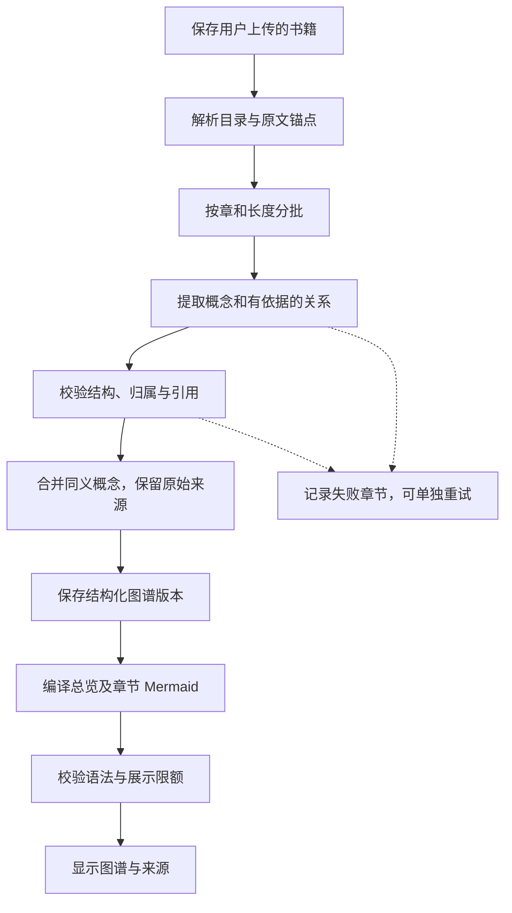

# 从书库到 Mermaid 概念图

## 当前交付与目标

目标流程：用户在「我的书库」上传书籍，Agent 根据解析后的原文提取概念及关系，生成可追溯、可编辑、可导出的 Mermaid 概念图。

已实现的应用管线位于 `src/modules/books`、`src/modules/ai` 和 `src/modules/jobs`：真实保存 / 解析 PDF、EPUB，分批抽取概念，校验来源后保存图谱与任务检查点，前端支持总览、批次查看、来源定位和导出。账号数据在服务端与数据库关联约束中隔离。

当前不自动合并跨批次同义概念，也不重新解析已就绪原书；以下合并、来源版本、细粒度阶段和语义核对能力为后续设计。实际状态为 `queued / running / ready / partial / failed / cancelled`；运行边界见 [实际架构](architecture.md)。历史 HTML 仍保留为独立原型，不连接服务端。

## 读者的操作路径

1. **在书库上传**：首批面向有文本层的 PDF 与无 DRM 的 EPUB；保存文件后显示真实解析状态。扫描件、加密文件、损坏文件明确告知原因。
2. **确认材料范围**：展示目录、可提取章节及页数；推断出的章节标注为建议目录。默认全书分析，可先选一章体验；调用模型前说明哪些正文将发送给配置的模型服务。
3. **生成概念图**：显示已处理章节数与失败章节，不使用虚构百分比。用户可以离开页面后回来查看，或者取消任务。
4. **从总览进入章节**：全书图优先展示主要概念，章节子图展开细节。图过大时拆分，显示节点数、处理范围和未覆盖章节。
5. **核对概念和关系**：点击节点查看定义、原文摘录和位置；关系列表显示起点、关系名称、终点及引用。来源必须属于当前书籍版本。
6. **继续学习**：从引用打开阅读工作台，再进入总结、问答或学习检测。查看图谱不自动标记掌握。
7. **导出或修改**：导出 Mermaid、带来源的 Markdown 或 SVG。修改源码后先校验语法，手动版本标记来源待核对；恢复自动生成版本前保留或导出修改。

书库卡片展示书名、解析状态、最近图谱版本和操作入口。首次打开没有书时提供上传入口和明确标注的内置示例；不能把示例图挂到用户选择的书名下。

## Agent 的执行边界

首版是单体应用中的受控任务管线，无需多 Agent 协作、独立图数据库或独立常驻后台进程。



执行步骤：

| 步骤 | 输入与输出 | 约束 |
| --- | --- | --- |
| 解析 | 原始文件 → 章节、SourceBlock、可定位的 SourceChunk | 先保存真实原文；空内容不调用模型 |
| 提取 | 本批片段及 ID → 概念、关系、引用 ID 与摘录 | 内容只作为数据；不执行书中命令，不允许模型自由调用工具 |
| 校验 | 模型 JSON → 已验证的候选结果或具体错误 | 校验字段、长度、关系端点、用户/书籍/版本/范围及摘录存在性 |
| 合并 | 各章候选结果 → 图谱 JSON | 同义概念保留别名与全部来源；同名异义分开；合并歧义保留为待核对项 |
| 概览 | 完整图谱 → 精简总览与章节子图 | 总览初始上限 20 个节点，单张图上限 30 个节点、60 条关系；超限拆分，不丢弃完整数据 |
| 编译 | 图谱 JSON 与展示选项 → Mermaid 文本 | 应用生成稳定安全的 ID、引号转义与固定样式；不直接展示模型返回的任意 Mermaid |
| 发布 | Mermaid 校验通过 → 可阅读的图谱版本 | 内容依据与语法有效分别记录；语法通过不能证明概念关系正确 |

上限是初始工程配置，后续以真实书籍的可读性和成本评估调整。首版未启用概念推断：没有原文明示依据时宁可少一条边，并返回缺少依据的说明。引用校验仅验证来源存在和合法性，概念关系是否忠实于原文仍需样例评估和人工核对。

## Skill 如何参与

项目内引入 [mermaid-visualizer](../skills/mermaid-visualizer/SKILL.md)，上游来源和固定提交见 [SOURCE.md](../skills/mermaid-visualizer/SOURCE.md)。

- Agent 的图表规划使用经过项目审阅的本地规则：概念和关系分析、纵向布局、基础 flowchart 语法、语义化 ID、无装饰性连线。
- 节点是概念，边必须有关系名称；全书图不是目录树。只有内容确实为层级关系时才考虑 mindmap，首版工作台统一使用 flowchart。
- 模型抽取结果先写结构化 JSON，再由确定性编译器形成 Mermaid。Skill 的语法指导用于编译规则和错误修复设计。
- `SKILL.md` 不是运行时解析器、模型服务或安全边界；书籍不能覆盖项目规则，也不能要求加载其他 skill 或执行工具。
- 当前原型使用本地 [Mermaid 12.1.0](../assets/vendor/mermaid-12.1.0/SOURCE.md)。样式使用 Reador 绿灰配色；导出采用基础语法，跨平台渲染效果可能略有不同。

## 输入与输出约定

服务端任务输入由登录身份和数据库确定，不信任客户端传入的拥有者或引用内容：`ownerId`、`bookId`、`sourceVersion`、章节范围、模型与提示词版本、skill 提交、编译器版本、布局及幂等键。批次携带 `chunkId`、`chapterId`、原文与原始位置；模型不需要收到用户身份或文件存储地址。

下面是**模型单批输出草案**，示例片段 `chunk-3-1` 包含：“主动回忆暴露理解缺口，反馈帮助纠正缺口，隔一段时间再进行回忆则检验内容是否仍能被独立提取。”

```json
{
  "schemaVersion": "1",
  "nodes": [
    {
      "id": "c1",
      "label": "主动回忆",
      "definition": "通过回忆暴露理解中的缺口。",
      "aliases": [],
      "citations": [{"chunkId": "chunk-3-1", "quote": "主动回忆暴露理解缺口"}]
    },
    {
      "id": "c2",
      "label": "反馈",
      "definition": "帮助纠正回忆时暴露的理解缺口。",
      "aliases": [],
      "citations": [{"chunkId": "chunk-3-1", "quote": "反馈帮助纠正缺口"}]
    }
  ],
  "edges": [
    {
      "source": "c1",
      "target": "c2",
      "type": "followed_by",
      "label": "暴露缺口后需要",
      "citations": [{"chunkId": "chunk-3-1", "quote": "主动回忆暴露理解缺口，反馈帮助纠正缺口"}]
    }
  ],
  "warnings": []
}
```

所有节点和关系至少有一处来源；单批 `id` 只用于连接，不直接作为持久化全局 ID。关系类型第一版限定为 `is_a`（属于）、`part_of`（组成）、`contrasts_with`（区别于）、`requires`（依赖）、`causes`（导致）、`supports`（支持）、`followed_by`（接续）、`tests`（检验），展示时保留中文关系名称。原文只有相关性时不强行标为因果关系。

运行时 schema 应拒绝未知字段、重复 ID、不存在的关系端点、空引用、超长文本和未知关系类型。正文中的特殊字符作为普通文本处理；ID 由编译器映射，禁止拼接标签形成可执行指令。

服务端额外保存：

- `GraphVersion`：稳定 ID、拥有者、书籍与来源版本、处理范围、图谱 JSON、各子图 Mermaid、模型/提示词/skill/编译器版本、创建时间。
- `GraphJob`：任务状态、幂等键、章节清单、成功/失败/未处理批次、重试次数、更新时间、可恢复的检查点。
- `Citation`：校验后的片段 ID、原文锚点、摘录及位置快照；重新解析后重新核对，不能把旧来源静默绑定到新内容。
- `coverage`：请求的、成功处理的、失败的和未处理的章节，由任务执行器汇总；模型不能自行声称“全书已覆盖”。

未来数据表以迁移创建。这些为完整设计约定；当前表结构与已实现校验见 `src/lib/schema.ts`、迁移和实际架构，不能将尚未实现的版本重定位或语义合并视为已有能力。

## 状态、失败与恢复

书籍解析与图谱生成独立记录。图谱任务使用 `queued → extracting → validating → compiling → ready / partial / failed`；取消后为 `cancelled`。

- **重复操作**：同一拥有者、书籍版本、范围、配置与幂等键返回同一个任务。用户明确重新生成时创建新版本，保留旧图谱。
- **长书与断线**：按批次保存检查点，重开页面读取任务状态。初期通过应用进程中的有限批次推进；进程重启后用租约过期和数据库检查点恢复，不把浏览器连接当作唯一任务状态。
- **部分失败**：仅对校验通过的内容生成部分图谱，标出实际覆盖范围；失败章节有单独重试入口，不冒充全书完成。
- **模型失败**：单次调用初始超时 60 秒，限流/网络故障最多重试 2 次并退避；格式或引用错误最多修复 1 次，仍不合法则保留失败状态。实际限额通过适配层配置。
- **Mermaid 失败**：保留有效 JSON 与错误位置。确定性编译重试修复最多 1 次，不允许为通过语法检查而改变概念含义或丢失来源；失败时禁止导出旧图作为新结果。
- **取消与并发**：取消时中止可取消的调用；晚到结果不能覆盖已取消任务。写入任务状态采用版本校验，防止旧结果覆盖新版本。
- **来源变化**：重新解析生成新的来源版本，旧图谱标记待核对；学习卡片和 FSRS 历史不受图谱重生成影响。

部署前按任务时长评估是否需要独立执行器；持久化任务接口保持不变，不为静态原型提前搭建队列服务。

## 验收顺序

1. 原型：书库选示例 → 生成全书图 → 章节/布局切换 → 点击节点及原文 → 编辑 → 校验 → 三种格式导出。
2. 原型边界：自选书籍不得生成示例图；空文件/错误扩展名/超限有反馈；无效源码不能导出；手动编辑失去未经核对的来源标记。
3. 真实导入：两章小书可解析并持久化，每个引用能定位，跨用户、跨书籍和旧版本来源被拒绝。
4. 模型质量：用人工标注的小型原文测试正确关系、同名异义、证据不足和正文中的伪指令；报告遗漏和不受支持的关系。
5. 恢复：取消、超时、断线、重复点击和重启后不会出现重复任务或丢失旧产物；部分结果有明确覆盖范围。

抽取提示词草案见 [prompts/book-concept-agent.md](../prompts/book-concept-agent.md)。原型验证不等同于上述后端与真实模型验收。
