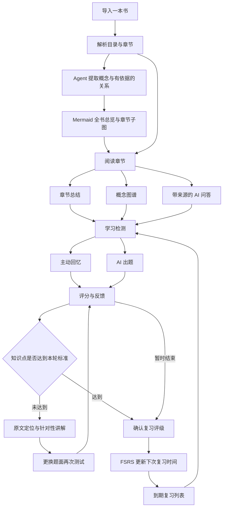

# Reador 产品方案

## 当前实现与已确认范围

2026-10-08：已实现多用户注册登录、账号隔离、PDF / EPUB 导入解析、EPUB 原书目录与 PDF 书签优先分节、原文阅读与位置保存、真实模型配置、分批总结 / 图谱、问答与教学、出题评分、补救练习及 FSRS 复习。正式入口改为 Next.js 应用，PostgreSQL 与应用支持 Docker Compose 本地运行；原 HTML 仅为历史设计参考。

本次用户确认：需要多人独立账号；仅支持 PDF / EPUB；当前优先本地开发和 Docker，数据库放入 Compose；DeepSeek / GLM 作为优先真实验收厂商，凭据由用户在应用可运行后通过系统设置填写。

以下为产品要求，具体能力和首版限制以 [README](../README.md) 与 [实际架构](architecture.md) 为准。当前没有 OCR、PDF 原版式 / 无书签目录推断、语义检索、跨批次概念合并或正文替换重解析；这些不能当作已实现功能。真实模型质量验收不能用本地协议模拟代替。

## 目标

让读者完成“读懂 → 回忆 → 找到误区 → 再学 → 长期记住”的学习闭环。AI 的输出需要服务于理解与记忆，并能回到书籍原文核对。

参考 [Learny 与 Tutor](references.md)：以 Learny 的原书阅读和来源证据为基础，结合 Tutor 根据学习反馈调整教学的方式。个性化对象是辅助讲解与练习，用户导入的原书不被改写。

## 核心流程

再次测试由用户主动发起，允许暂停。避免将未掌握流程变成无法退出的循环；结束时保留薄弱知识点。

## 首版范围

首版服务个人阅读场景，以桌面 Web 为优先，支持一本书内的章节阅读与学习。按用户确定的“我的书库上传一本书 → Agent 生成 Mermaid 概念图”推进；目标材料为可提取文本的 PDF 和无 DRM 的 EPUB，解析器逐个接入，扫描件 OCR 留待后续。

| 模块 | 首版行为 | 验收要点 |
| --- | --- | --- |
| 书库与导入 | 上传 PDF / EPUB、展示解析状态和章节目录、发起概念图生成 | 解析失败有原因；空内容、格式不支持均可识别；重复操作不重复创建任务 |
| 阅读工作台 | 按章查看原文、保存阅读位置 | 刷新后可继续阅读；引用能定位到对应段落 |
| 选段教学 | 选中文字后解释或进入渐进提示；可跳过地填写目标、基础与解释偏好 | 教学不打断阅读；用户可选择直接讲解，原书保持不变 |
| 章节总结 | 提炼主旨、论点、关键概念与易混淆点 | 关键结论附来源；可重新生成，保留版本信息 |
| 概念图谱 | Agent 提取概念及有名称的关系，生成 Mermaid 全书总览和章节子图，可导出源码与 SVG | 节点和关系列表可回到原文；有覆盖范围与版本；部分失败能重试；编辑后重新核对来源 |
| AI 问答 | 围绕当前章提问，可显式扩大到整本书 | 答案标注来源；证据不足时说明限制 |
| 主动回忆 | 收起 AI 总结和答案，让用户复述指定内容 | 提交前不泄露参考答案；支持跳过并记录 |
| AI 出题 | 围绕明确知识点生成简答题 | 题目有参考答案、评分要点与原文依据 |
| 评分与补救 | 展示命中要点、遗漏和错误，按错误类型与已有基础调整讲解 | 用户能纠正评分；再次测试改变提问角度并保持同一知识目标 |
| 间隔复习 | 用 FSRS 为知识点复习卡排期，展示到期任务 | 到期时间持久化；一次提交只更新一次调度 |

首版暂不包含多人协作、社交书评、自动购买书籍、DRM 解密、复杂手写批注、独立移动客户端与模型微调。

## 页面结构

- **书库**：一书一卡的封面网格，卡片展示书名、解析状态、生成或打开概念图及继续阅读入口；末尾提供添加书籍卡片，窄屏自动换行。未取得真实封面时使用明确标注的文字封面。
- **概念图工作台**：书籍/范围/布局切换、处理阶段、Mermaid 图表、概念和关系来源、源码编辑与导出。
- **阅读工作台**：目录、原文区域、总结 / 图谱 / 问答与教学面板；选段提供“解释这段 / 引导我理解 / 测测我”入口。
- **学习检测**：主动回忆或答题、提交后的反馈、补救讲解与再测、最终评级。
- **系统设置 / Agent 配置**：提供常用厂商官方预设及第三方 / 自建网关，按协议配置 Base URL、模型 ID 和调用参数，管理多组配置并指定默认 Agent。密钥由服务端加密保存，连接测试与真实生成通过协议适配层运行。
- **复习计划**：支持全部书籍总览和单本书筛选；任务关联书籍、章节与知识点，按书显示待复习和已完成数量。从书库可直接进入该书计划，开始复习仅处理当前选择范围。真实服务接入后展示到期知识点、薄弱项、完成记录与下一次复习时间；未解析或尚无复习卡的书籍展示空状态，不能借用其他书的任务。

辅助面板可折叠，问答和教学保留同一段阅读上下文。界面明确显示选段、当前章或整本书的回答范围；范围内证据不足时，先说明再提供扩大范围的操作。首版默认以当前章为界，不承诺精确到尚未读过的每一段；逐段防剧透待阅读位置和来源映射稳定后再扩展。

## 教学与检测的边界

引导教学从一个诊断问题开始，依次提供线索、关键提示和完整讲解，用户随时可以直接查看讲解或退出。正式检测先隐藏参考答案、讲解及原文；用户请求帮助时记录辅助类型，评分时区分独立作答与辅助作答。

学习目标、已有基础和解释偏好可跳过、可修改。首版按本章实际作答调整讲解和下一道练习，无需先完成档案访谈；自动更新长期技能档案留待后续。

## 评分与调度

AI 按明确的评分要点给出建议分数。首版可以按要点加权得到 0–100 分，但“达到标准”的阈值应可配置，并结合关键误解判断。阈值只是产品策略，不是对学习效果的科学保证。

界面将“本轮达到标准”和“稳定掌握”区分开。后者需要跨时间的复习证据，不能由一次高分决定。

FSRS 使用 Again / Hard / Good / Easy 四档记忆评级。AI 评分用于反馈和提出评级建议；用户确认后形成最终评级。答错或无法回忆默认建议 Again，Hard 表示确实回忆成功但困难，不能把失败简单映射到 Hard。

同一轮中，初次未能回忆、看过讲解、随后答对都保留在学习记录中。看完答案后的成功不能自动覆盖最初的失败，也不能作为连续多次成功复习。FSRS 自身安排的短间隔学习步骤与这种即时补救练习分别记录。

## 一条完整的验收路径

1. 导入包含至少两章的测试书籍，完成解析并打开第一章。
2. 生成总结与概念关系，点击引用能定位到正确的原文。
3. 提出一道原文能回答的问题，以及一道原文证据不足的问题，检查来源与拒绝臆测行为。
4. 完成一次主动回忆或简答测验；提交前看不到参考答案。
5. 故意漏答一个关键点，得到对应讲解与不同题面的再次测试。
6. 确认本轮评级后生成复习卡和到期时间；重复点击提交不产生重复调度。
7. 刷新页面或重启服务后，书籍、学习记录与复习计划仍然存在。
8. 在可控时间的测试中进入到期复习，完成作答并生成下一次计划。
9. 在选段教学中先请求提示，再选择直接讲解；切换到检测后，辅助情况被保留，原文内容没有变化。
10. 提问涉及后续章节时，系统在当前范围说明证据不足；用户主动扩大范围后才使用新增来源。
11. 重新生成同一知识目标的题面或重新解析书籍，已有调度和历史保持；无法匹配的旧来源被标记并暂停该卡自动出题。

## 实施顺序

1. **项目骨架与材料导入**：按 PDF / EPUB 入口搭建单体应用，完成文本解析、原文定位和持久化。
2. **书库与图谱优先**：接入概念抽取 Agent 和 Mermaid 编译，打通上传到可核对图谱；随后完成章节总结、问答与选段教学。
3. **学习检测**：完成主动回忆、简答题、评分解释与补救流程。
4. **长期复习**：接入真实 FSRS、保存复习历史、提供到期队列，验证整个闭环。

每一步的交付都应可单独运行或验证；首版发布以完整验收路径通过为准。

书库与图谱的交互、Agent 数据约定、skill 使用方式和单独验收路径见 [书籍概念图 Agent](book-concept-agent.md)。应用已连接上传、正文解析、模型适配、PostgreSQL 持久化与 FSRS；运行检查见应用验收记录。真实模型验收待用户配置可用凭据。
